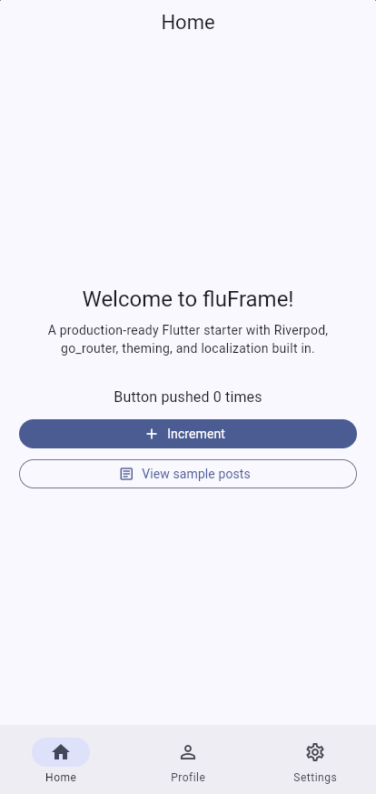
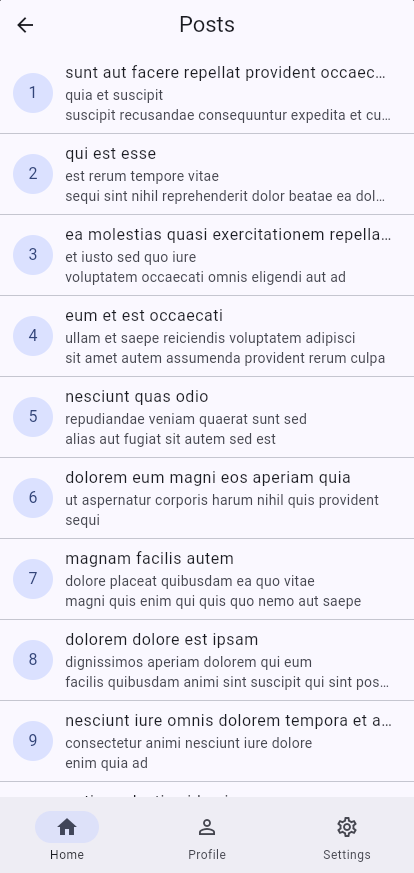
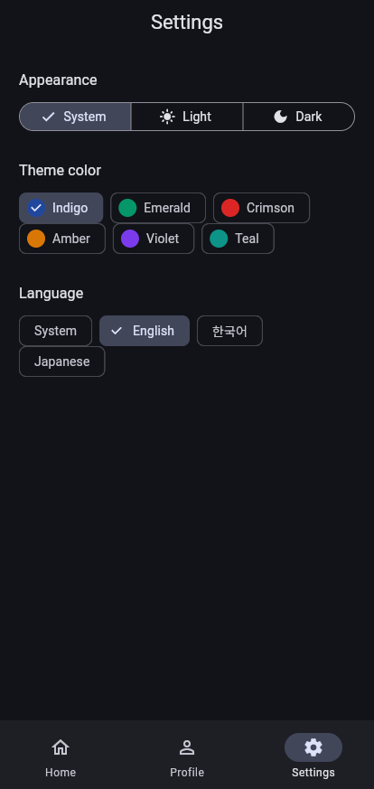

# fluFrame

[](https://github.com/JoGyoungJun/fluFrame/actions/workflows/ci.yml)
[](https://pub.dev/packages/fluframe)
[](LICENSE)

**한 번의 명령으로 프로덕션 수준의 Flutter 앱을.**

fluFrame은 Flutter 보일러플레이트 + CLI입니다. `fluframe create my_app` 한 줄로
상태관리, 라우팅, 테마, 다국어, 네트워킹, 플레이버, 엄격한 lint, 테스트까지
모두 연결되어 있고 전부 통과하는 feature-first Flutter 앱을 생성합니다.

[English README](README.md)

| 홈 | 샘플 REST 기능 | 테마 & 4개 언어 |
|:---:|:---:|:---:|
|  |  |  |

`fluframe create` 결과물 그대로이며, 손댄 곳이 없습니다.

## 빠른 시작

```sh
dart pub global activate fluframe
fluframe create my_app --org com.mycompany --backend supabase
cd my_app
flutter run --dart-define-from-file=env/dev.json

fluframe upgrade   # 나중에: 템플릿 개선 사항을 내 앱으로 가져오기
```

1.0 이후의 안정성 약속은 [docs/versioning.md](docs/versioning.md)에
문서화되어 있습니다.

또는 이 저장소를 GitHub 템플릿으로 사용해 [`template/`](template/)에서 바로
시작할 수도 있습니다.

## 포함된 것들

| 영역 | 솔루션 |
|---|---|
| 상태관리 | [flutter_riverpod](https://pub.dev/packages/flutter_riverpod) 3 — 수동 `Notifier`/`AsyncNotifier`, 프로바이더 코드젠 없음 |
| 네비게이션 | [go_router](https://pub.dev/packages/go_router) 17 — `StatefulShellRoute` 하단 탭, 중첩 라우트 |
| 인증 | 백엔드 중립 스캐폴드: 로그인/프로필 플로, 라우트 게이팅, 세션 영속화 — provider 하나 교체로 [Supabase](docs/guides/auth-supabase.md)·[Firebase](docs/guides/auth-firebase.md) 연결 |
| 모델 | [freezed](https://pub.dev/packages/freezed) 3 + json_serializable, REST 샘플 기능 포함 |
| 네트워킹 | [dio](https://pub.dev/packages/dio) — `DioException` → sealed `ApiException` 매핑 |
| 영속화 | `SharedPreferencesAsync`를 감싼 `KeyValueStore` 인터페이스 — 테스트에서 쉽게 대체 가능 |
| 다국어 | `flutter gen-l10n` (영어 + 한국어 기본 포함) |
| 테마 | 시드 컬러 기반 Material 3 라이트/다크, `ThemeMode` 영속화 |
| 플레이버 | `--dart-define-from-file` + `env/dev.json` / `env/prod.json` |
| Lint | [very_good_analysis](https://pub.dev/packages/very_good_analysis) — 경고 0건 |
| 테스트 | mocktail + Riverpod override 기반 단위/위젯 테스트 — 처음부터 전부 통과 |

## 저장소 구조

```text
├── template/            # 보일러플레이트 앱 (fluframe_app) — 항상 컴파일되고 항상 테스트됨
└── packages/
    └── fluframe/        # pub.dev에 배포되는 CLI (fluframe create)
```

CLI는 먼저 **사용자의** Flutter SDK로 `flutter create --empty`를 실행한 뒤 —
플랫폼 폴더가 항상 설치된 Flutter 버전과 일치합니다 — 템플릿의 `lib/`,
`test/`, 설정 파일을 덮어쓰고 패키지명 토큰을 치환합니다.

## 예제

`fluframe create`로 생성한 뒤 문서화된 컨벤션 그대로 확장한 실제 앱들:

- [`examples/todo_app`](examples/todo_app) — 새 기능 모듈+탭으로 추가된
  영속 투두리스트 (freezed, KeyValueStore, AsyncNotifier, l10n, 테스트)
- [`examples/weather_app`](examples/weather_app) — 키 없는 공개 API
  (Open-Meteo)로 현재 날씨 표시: 절대 URL dio 호출, FutureProvider.family,
  도시 선택

## 개발 (이 저장소)

```sh
# 템플릿 앱
cd template
flutter pub get && flutter gen-l10n
flutter analyze && flutter test

# CLI
cd packages/fluframe
dart pub get
dart analyze && dart test -x e2e   # 단위 테스트
dart test -t e2e                   # 전체 e2e (실제 앱을 생성해 검증)
```

## 기여

기여를 환영합니다 — [CONTRIBUTING.md](CONTRIBUTING.md)를 참고하세요.
큰 변경은 먼저 이슈를 열어주세요.

## 라이선스

[MIT](LICENSE)
