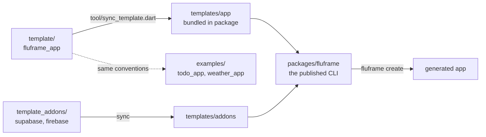

# fluFrame architecture

One page for contributors: how the pieces fit and which invariants must
never break. Decisions live in [ADRs](adr/), feature designs in
[design specs](design/).

## The monorepo



- **`template/`** — a real, runnable Flutter app (`fluframe_app`). CI
  keeps it at `flutter analyze` 0 issues / all tests green at all times.
- **`packages/fluframe`** — the CLI published to pub.dev. The template
  (and addons) travel inside the published package, synced by
  `tool/sync_template.dart` at release time.
- **`examples/`** — apps generated with the CLI and extended by the
  documented conventions. CI runs each in a matrix (they compile and their
  suites pass) *and* runs `tool/check_example_drift.dart`, which compares
  every shared file against the token-rewritten template. The matrix alone
  was not enough: both examples had silently lost
  `core/logging/error_handlers.dart` while this line claimed they could
  not rot. Files an example legitimately owns are listed, with reasons, in
  that tool.

## The generation pipeline

`fluframe create my_app --org com.x --backend supabase` runs:

1. `flutter create --empty` — platform folders always match the USER's
   Flutter version (we never ship platform files).
2. **Overlay** — the bundled template's `lib/`, `test/`, `env/`, configs
   are copied over the scaffold.
3. **Token rewrite** — `fluframe_app` → project name, `FluFrame App` →
   humanized title, `FluFrame 앱` → title + ` 앱`, `FluFrame アプリ` →
   title + ` アプリ`, applied to every text file (committed generated
   code included, which is why it survives the rename —
   [ADR 0004](adr/0004-committed-codegen.md)).
4. **Backend addon** (optional, [ADR 0001](adr/0001-backend-addon-overlays.md)) —
   extra deps via `flutter pub add`, addon files, and anchored patches
   that FAIL LOUDLY if the template drifted.
5. `flutter pub get` → `dart fix --apply` (renaming changes import sort
   order) → `flutter gen-l10n`.

## Template app layers

```text
lib/
├── main.dart      # bootstrap: error hooks, persisted settings, overrides
├── app/           # MaterialApp.router + GoRouter + themes
├── core/          # config, network (dio+ApiException), storage
│                  # (KeyValueStore), logging (+ error_handlers), widgets
├── features/<f>/  # data/ (repos) · domain/ (freezed) · presentation/
└── l10n/          # ARB (en+ko+ja) + generated code (committed)
```

Patterns to copy when adding features: repository behind a provider,
hand-written `Notifier`/`AsyncNotifier`
([ADR 0003](adr/0003-riverpod-manual-notifiers.md) — no provider
codegen, family args go to the constructor, `flutter_riverpod/legacy.dart`
is off-limits), `AsyncValueWidget` for async UI, `initialXProvider`
overrides for pre-`runApp` state. Models are freezed + json_serializable
with the output committed ([ADR 0004](adr/0004-committed-codegen.md)).

`core/widgets/content_width.dart` caps body content at **840dp** — the
Material 3 expanded-window floor — so a screen does not run edge to edge
on web or desktop ([spec 005](design/005-wide-viewport-content-width.md)).
Wrap a `Scaffold`'s `body`, never the `Scaffold`: app bars and the
navigation bar stay full-bleed. For a scrollable body pass
`ContentWidth.insetFor(...)` as its `padding` instead of wrapping it — a
wrapped `ListView` only takes pointer events inside its own box, so the
mouse wheel would stop working over the gutters. `fluframe add feature`
emits this for you, so a new feature inherits the cap.

## Invariants (break one and CI/e2e will catch you)

1. **Rename tokens** must appear exactly, all four: `fluframe_app`,
   `FluFrame App`, `FluFrame 앱`, `FluFrame アプリ`.
2. **Anchored addon patches**: certain `template/lib/main.dart` and
   `auth_repository.dart` lines are patch anchors — edit them and the
   addon e2e fails until `packages/fluframe/lib/src/backends.dart` is
   updated to match.
3. **`.pubignore` patterns stay slash-anchored** (`/test/` not `test/`)
   or the published bundle loses its test suite.
4. **Generated code is committed** (`*.freezed.dart`, `*.g.dart`,
   `lib/l10n/gen/`) and CI verifies it is up to date —
   [ADR 0004](adr/0004-committed-codegen.md).
5. **Every UI string in ALL THREE ARBs** (`app_en.arb`, `app_ko.arb`,
   `app_ja.arb`). `flutter gen-l10n` falls back to English and only
   warns, so nothing but review catches a missing locale.
6. Generated-app tests stay backend-agnostic: test helpers pin
   `authRepositoryProvider` to the in-memory fake.

## Quality gates

Local: `/verify` (or the commands in CONTRIBUTING). CI: template job,
CLI unit job, e2e job (generates base + supabase + firebase variants and
runs their full suites), examples matrix. Releases: tag push →
`publish.yml` re-runs every gate → OIDC publish to pub.dev.
