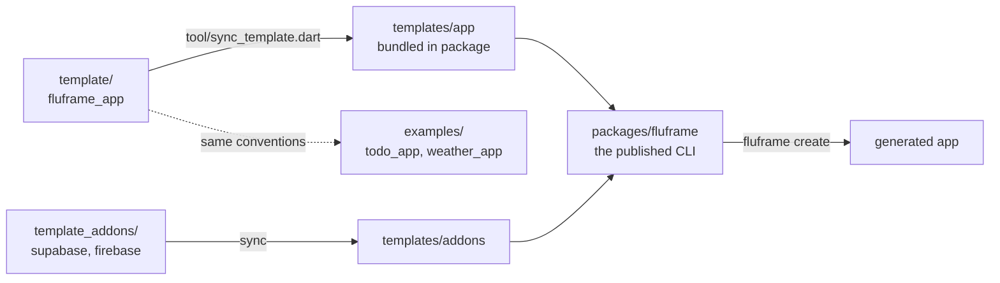

# fluFrame architecture

One page for contributors: how the pieces fit and which invariants must
never break. Decisions live in [ADRs](adr/), feature designs in
[design specs](design/).

## The monorepo



- **`template/`** — a real, runnable Flutter app (`fluframe_app`). CI
  keeps it at `flutter analyze` 0 issues / all tests green at all times.
- **`packages/fluframe`** — the CLI published to pub.dev. The template
  (and addons) travel inside the published package, synced by
  `tool/sync_template.dart` at release time.
- **`examples/`** — apps generated with the CLI and extended by the
  documented conventions; CI runs them in a matrix so they cannot rot.

## The generation pipeline

`fluframe create my_app --org com.x --backend supabase` runs:

1. `flutter create --empty` — platform folders always match the USER's
   Flutter version (we never ship platform files).
2. **Overlay** — the bundled template's `lib/`, `test/`, `env/`, configs
   are copied over the scaffold.
3. **Token rewrite** — `fluframe_app` → project name, `FluFrame App` →
   humanized title, `FluFrame 앱` → title + ` 앱`, applied to every text
   file.
4. **Backend addon** (optional, [ADR 0001](adr/0001-backend-addon-overlays.md)) —
   extra deps via `flutter pub add`, addon files, and anchored patches
   that FAIL LOUDLY if the template drifted.
5. `flutter pub get` → `dart fix --apply` (renaming changes import sort
   order) → `flutter gen-l10n`.

## Template app layers

```text
lib/
├── main.dart      # bootstrap: error hooks, persisted settings, overrides
├── app/           # MaterialApp.router + GoRouter + themes
├── core/          # config, network (dio+ApiException), storage
│                  # (KeyValueStore), logging (+ error_handlers), widgets
├── features/<f>/  # data/ (repos) · domain/ (freezed) · presentation/
└── l10n/          # ARB (en+ko) + generated code (committed)
```

Patterns to copy when adding features: repository behind a provider,
`Notifier`/`AsyncNotifier` (no provider codegen), `AsyncValueWidget` for
async UI, `initialXProvider` overrides for pre-`runApp` state.

## Invariants (break one and CI/e2e will catch you)

1. **Rename tokens** must appear exactly: `fluframe_app`,
   `FluFrame App`, `FluFrame 앱`.
2. **Anchored addon patches**: certain `template/lib/main.dart` and
   `auth_repository.dart` lines are patch anchors — edit them and the
   addon e2e fails until `packages/fluframe/lib/src/backends.dart` is
   updated to match.
3. **`.pubignore` patterns stay slash-anchored** (`/test/` not `test/`)
   or the published bundle loses its test suite.
4. **Generated code is committed** (`*.freezed.dart`, `*.g.dart`,
   `lib/l10n/gen/`) and CI verifies it is up to date.
5. **Every UI string in BOTH ARBs** (`app_en.arb`, `app_ko.arb`).
6. Generated-app tests stay backend-agnostic: test helpers pin
   `authRepositoryProvider` to the in-memory fake.

## Quality gates

Local: `/verify` (or the commands in CONTRIBUTING). CI: template job,
CLI unit job, e2e job (generates base + supabase + firebase variants and
runs their full suites), examples matrix. Releases: tag push →
`publish.yml` re-runs every gate → OIDC publish to pub.dev.
